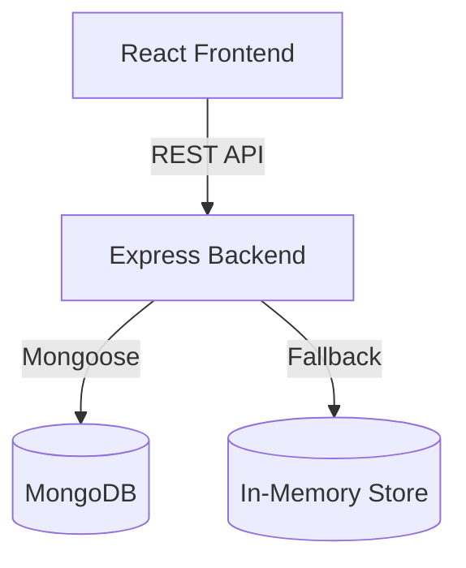

# Software Requirements Specification

## Document Information
- **Project name:** FleetFlow
- **Document title:** Software Requirements Specification (SRS)
- **Version:** 1.0
- **Document status:** Draft (Generated via Source Code Analysis)
- **Prepared date:** 2026-08-25
- **Technology stack:** React 19, Vite, Tailwind CSS v4, Node.js, Express, MongoDB/Mongoose.
- **Prepared from actual source-code analysis:** Yes

## Revision History
| Version | Date | Description | Author |
|---|---|---|---|
| 1.0 | 2026-08-25 | Initial generated SRS based on project codebase | AI Analyst |

## 1. Introduction
### 1.1 Purpose
This document specifies the software requirements for the FleetFlow application, detailing both implemented features and necessary functional/non-functional requirements for a complete production system.

### 1.2 Project Overview
FleetFlow is a fleet management web application designed to track vehicles, drivers, trips, maintenance logs, and expenses. It features a modern 3D visualization interface and a MERN-stack architecture.

### 1.3 Problem Statement
Organizations need a centralized digital platform to track fleet assets, dispatch trips, and monitor driver availability and vehicle maintenance statuses effectively.

### 1.4 Proposed Solution
FleetFlow provides an interactive dashboard with modules for Vehicle Registry, Trip Dispatcher, Maintenance Logs, Driver Profiles, and Expense & Fuel Logging, along with an interactive 3D visualizer and analytical KPI metrics.

### 1.5 Objectives
- Digitize fleet tracking and dispatching.
- Manage driver profiles and vehicle maintenance.
- Provide real-time KPI dashboards for fleet managers.

### 1.6 Scope
The scope includes a public-facing (or internal) web application connected to a Node.js API with a MongoDB database. It includes CRUD operations for various fleet entities.

### 1.7 Intended Audience
Fleet Managers, Dispatchers, Safety Officers, Financial Analysts, and Development Teams.

### 1.8 Definitions, Acronyms and Abbreviations
- **MERN:** MongoDB, Express.js, React, Node.js.
- **KPI:** Key Performance Indicator.

### 1.9 References
- Source code in the `c:\Users\dell\Downloads\FleetFlow\FleetFlow-main` workspace.

### 1.10 Document Overview
This document covers the overall description, system architecture, functional and non-functional requirements, external interfaces, data requirements, use cases, security, and traceability matrices.

## 2. Overall Description
### 2.1 Product Perspective
FleetFlow operates as a standalone web application utilizing a Single Page Application (SPA) frontend and a RESTful backend API.

### 2.2 Product Functions
- User registration and authentication.
- Vehicle inventory management.
- Driver profile management.
- Trip creation and dispatching.
- Maintenance logging.
- Expense tracking.
- KPI dashboard visualization.

### 2.3 User Classes and Characteristics
- **Fleet Manager:** Has access to all fleet data, KPIs, and configuration.
- **Dispatcher:** Manages trips and driver assignments.
- **Safety Officer:** Focuses on maintenance logs and driver safety scores.
- **Financial Analyst:** Manages and reviews expense and fuel logs.

### 2.4 Operating Environment
- **Frontend:** Modern web browsers supporting ES6+ and WebGL (for 3D features).
- **Backend:** Node.js v18+.
- **Database:** MongoDB Atlas or local MongoDB instance.

### 2.5 Design and Implementation Constraints
- The frontend is tightly coupled with the backend in a single monolithic structure (served via Express in production).

### 2.6 Assumptions and Dependencies
- Relies on MongoDB connectivity. An in-memory fallback exists in the code but is not suitable for persistent production data.

### 2.7 External Services and APIs
- None explicitly required for core functionality, though local storage is used heavily as a fallback.

### 2.8 Out-of-Scope Features
- Live GPS tracking hardware integration (currently simulated).
- Automated payments for expenses.

## 3. System Architecture
### High-level Architecture
Client-Server architecture where a React SPA communicates with an Express REST API, connected to a MongoDB backend.

### Frontend Architecture
React 19 application built with Vite, styled with Tailwind CSS, utilizing Framer Motion for animations and Three.js for 3D visualizations.

### Backend Architecture
Node.js with Express.js exposing REST endpoints. It uses an in-memory mock database if the MongoDB connection URI is absent.

### Database Architecture
Mongoose ODM is used to define schemas (`Vehicle`, `Driver`, `Trip`, `MaintenanceLog`, `ExpenseLog`, `User`).

### Authentication Flow
Currently implemented as a plaintext login flow returning a mocked JWT. Authentication middleware is missing in the architecture.

### Data Flow
Frontend components -> Axios API calls -> Express Routers -> Mongoose Models -> MongoDB.

## 4. Functional Requirements

### 4.1 Authentication Module
**FR-001: User Registration**
- **Requirement ID:** FR-001
- **Requirement name:** User Registration
- **Description:** Users can register an account.
- **User role:** Guest
- **Preconditions:** None
- **Trigger:** Submitting the registration form.
- **Main flow:** User enters name, email, role, and password. System creates the user.
- **Alternative flow:** Email exists -> return error.
- **Postconditions:** User is saved in database.
- **Input:** Name, email, password, role.
- **Validation rules:** Required fields.
- **Expected output:** User object and token.
- **Error conditions:** 400 Bad Request if user exists.
- **Priority:** Must Have
- **Source evidence:** `server.ts` route `/api/auth/register`

**FR-002: User Login**
- **Requirement ID:** FR-002
- **Requirement name:** User Login
- **Description:** Users can log in using email and password.
- **User role:** All Roles
- **Preconditions:** Registered account.
- **Trigger:** Submitting login form.
- **Main flow:** Validate credentials, return fake token.
- **Alternative flow:** Invalid credentials -> error.
- **Postconditions:** Token returned.
- **Input:** Email, password.
- **Validation rules:** Must match DB records.
- **Expected output:** Auth token.
- **Error conditions:** 401 Unauthorized.
- **Priority:** Must Have
- **Source evidence:** `server.ts` route `/api/auth/login`

### 4.2 Vehicle Registry
**FR-003: Create Vehicle**
- **Requirement ID:** FR-003
- **Requirement name:** Create Vehicle
- **Description:** Managers can add new vehicles to the fleet.
- **User role:** Fleet Manager
- **Preconditions:** Logged in.
- **Trigger:** Submit new vehicle form.
- **Main flow:** Sends vehicle details to API -> Saved in DB.
- **Alternative flow:** Duplicate license plate -> Error.
- **Postconditions:** Vehicle is added.
- **Input:** Name, model, license plate, capacity, type.
- **Validation rules:** License plate must be unique.
- **Expected output:** Vehicle object.
- **Error conditions:** 400 Bad Request.
- **Priority:** Must Have
- **Source evidence:** `server.ts` route `/api/vehicles`

**FR-004: List Vehicles**
- **Requirement ID:** FR-004
- **Requirement name:** List Vehicles
- **Description:** Display all vehicles.
- **User role:** All
- **Preconditions:** Logged in.
- **Trigger:** Navigating to Vehicle Registry.
- **Main flow:** Fetch from API and render list.
- **Alternative flow:** None.
- **Postconditions:** Data is displayed.
- **Input:** None.
- **Validation rules:** None.
- **Expected output:** JSON Array of Vehicles.
- **Error conditions:** 500 Server Error.
- **Priority:** Must Have
- **Source evidence:** `server.ts` route `GET /api/vehicles`

### 4.3 Trip Dispatcher
**FR-005: Create Trip**
- **Requirement ID:** FR-005
- **Requirement name:** Create Trip
- **Description:** Dispatchers can create a new trip and assign a vehicle and driver.
- **User role:** Dispatcher
- **Preconditions:** Logged in.
- **Trigger:** Submit trip form.
- **Main flow:** API call to save trip data.
- **Alternative flow:** Missing fields -> Error.
- **Postconditions:** Trip saved, vehicle/driver status updated.
- **Input:** Vehicle ID, Driver ID, Route details.
- **Validation rules:** IDs must be valid.
- **Expected output:** Trip object.
- **Error conditions:** 400 Bad Request.
- **Priority:** Must Have
- **Source evidence:** `server.ts` route `/api/trips`

## 5. Non-Functional Requirements
- **NFR-001 (Performance):** Dashboard APIs must return KPIs in under 500ms.
- **NFR-002 (Security):** Passwords must be hashed (Currently FAILED).
- **NFR-003 (Security):** API endpoints must require valid JWT authorization (Currently FAILED).
- **NFR-004 (Reliability):** System should fallback gracefully if DB is down (Implemented via in-memory store).
- **NFR-005 (Usability):** UI must be responsive across desktop and mobile devices.

## 6. External Interface Requirements
### 6.1 User Interface Requirements
Modern, dark-themed responsive dashboard using Tailwind CSS.

### 6.2 API Interface Requirements
- **Endpoint:** `GET /api/health`
  - **Purpose:** System health check
  - **Required Auth:** None
  - **Request Params:** None
  - **Expected Response:** JSON status
  - **Frontend Consumer:** `api.ts` -> `checkHealth()`

- **Endpoint:** `POST /api/auth/login`
  - **Purpose:** User authentication
  - **Required Auth:** None
  - **Request Params:** email, password
  - **Expected Response:** User object and token
  - **Important Error Responses:** 401 Invalid password.

- **Endpoint:** `GET /api/vehicles`
  - **Purpose:** List vehicles
  - **Required Auth:** None (Vulnerability)
  - **Request Params:** None
  - **Expected Response:** Array of vehicles

## 7. Data Requirements
- **Database technology:** MongoDB (Mongoose)
- **Entities:**
  - `User`: id (PK), name, email (Unique), password, role.
  - `Vehicle`: id (PK), name, model, licensePlate (Unique), status.
  - `Driver`: id (PK), name, licenseNumber, safetyScore.
  - `Trip`: id (PK), vehicleId (FK), driverId (FK), origin, destination.
  - `MaintenanceLog`: id (PK), vehicleId (FK), cost.
  - `ExpenseLog`: id (PK), vehicleId (FK), category, amount.
- **Data-isolation expectations:** Users should theoretically only see their organization's data, but currently, ownership fields (`userId`, `orgId`) are missing from all entities except `User`.

## 8. Use Cases
**UC-01: Dispatch a Trip**
- **Use-case ID:** UC-01
- **Use-case name:** Dispatch Trip
- **Actor:** Dispatcher
- **Goal:** Assign a driver and vehicle to a new route.
- **Preconditions:** Logged in. Available driver and vehicle exist.
- **Main success scenario:** Navigate to Trip Dispatcher -> Click "New Trip" -> Select Driver and Vehicle -> Enter route -> Save.
- **Alternative scenario:** Validation fails, user corrects input.
- **Failure scenario:** Network error, data not saved.
- **Postconditions:** Trip is created.

## 9. User Stories and Acceptance Criteria
**US-01:** "As a Fleet Manager, I want to add a new vehicle so that it can be dispatched."
- **Acceptance Criteria:**
  - Given I am logged in.
  - When I submit the new vehicle form with valid data.
  - Then the vehicle is saved to the database and appears in the registry.

## 10. Security Requirements
- **Password storage:** Must be securely hashed using bcrypt. (Currently plaintext).
- **Authentication:** Must issue and validate signed JWTs. (Currently mocked).
- **Authorization:** Must implement Role-Based Access Control (RBAC). (Currently missing).
- **Data Isolation:** Queries must be scoped to the authenticated user's organization. (Currently missing).

## 11. Validation and Error Handling
- **Frontend validation:** Implemented in forms (e.g., required fields).
- **Backend validation:** Relies heavily on Mongoose schemas.
- **Error structure:** Returns `{ error: 'Message' }` on 400/500 status codes.

## 12. Testing Requirements
- **Unit testing:** None currently exist (`tsc --noEmit` is the only check).
- **API testing:** Required for all CRUD operations.
- **Security testing:** Required for authentication endpoints.

## 13. Deployment Requirements
- **Development environment:** Node.js with Vite middleware. Start via `npm run dev`.
- **Production environment:** Built with `npm run build`. Served via `npm start`.
- **Required environment variables:** `MONGODB_URI`
- **Database migration:** Automated via Mongoose schemas.

## 14. Limitations
- Security is functionally non-existent.
- Single-tenant architecture with global data sharing.

## 15. Future Enhancements
- Live GPS Telematics integration.
- Automated Maintenance Scheduling based on odometer readings.

## 16. Requirement Traceability Matrix
| Requirement ID | Requirement | Source Evidence | Implementation Evidence | Test Evidence | Status |
|---|---|---|---|---|---|
| FR-001 | User Registration | `server.ts` | API implemented | None | Fully Implemented |
| FR-002 | User Login | `server.ts` | API implemented | None | Implemented but Broken |
| FR-003 | Create Vehicle | `server.ts` | API implemented | None | Fully Implemented |
| NFR-002 | Password Hashing | `User.ts` | Stored as plaintext | None | Not Implemented |
| NFR-003 | API Security | `server.ts` | No middleware used | None | Not Implemented |

## 17. Acceptance Criteria for Final Delivery
- [ ] User passwords are hashed in the database.
- [ ] API endpoints are protected with JWT validation middleware.
- [ ] Data is isolated per user/organization.
- [ ] Automated tests cover core workflows.

## 18. Conclusion
FleetFlow is an architecturally sound prototype with an impressive UI, but it completely lacks backend security, authentication enforcement, and data isolation, making it unfit for production until these critical gaps are addressed.
